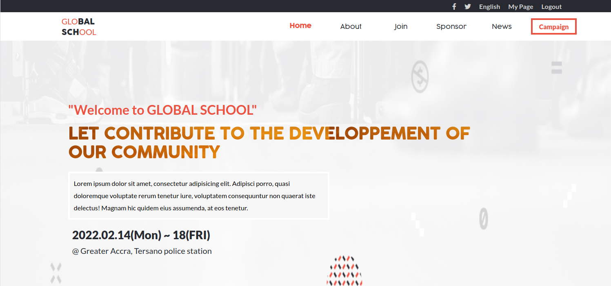
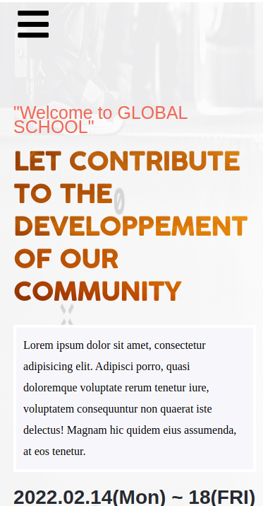

# Global School Conferance 

> This project is about internation school were every children from different county and continent can lean as they where in the same class room.

## Built With

- HTML
- CSS
- Javascript

## Live Demo

For the link to the live demo, [Click here](https://lionrouge1.github.io/capstone_M1/)

## Video link
Link of video, [Here](https://www.loom.com/share/a52a9d49d19c4daf87b9f66393f6e7af)
## Authors

👤 **Author1**

- GitHub: [@githubhandle](https://github.com/LionRouge1)
- Twitter: [@twitterhandle](https://twitter.com/Matchoudi1)
- LinkedIn: [LinkedIn](www.linkedin.com/in/matchoudi)

## 🤝 Contributing

Contributions, issues, and feature requests are welcome!

Feel free to check the [issues page](../../issues/).

## Show your support

Give a ⭐️ if you like this project!

## Acknowledgments

- Thanks to Cindy Shin whose design of cc global summit 2015 was used.

## 📝 License

This project is [MIT](./MIT.md) licensed.
