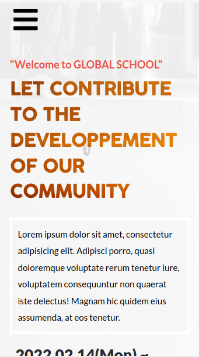

# Global School Conference 

> Global School is an online website for schools where every student from different countries can learn as if they were in the same classroom.

# Built With

- HTML
- CSS
- Javascript

# Getting Started

- `git clone https://github.com/LionRouge1/capstone_M1.git` to clone the repo.
- `cd capstone_M1.git`
- Open `index.html` any browser of your choise

# Live Demo

The live demo, [Click here](https://lionrouge1.github.io/capstone_M1/)

## Video link
Link of video, [Here](https://www.loom.com/share/a52a9d49d19c4daf87b9f66393f6e7af)
# Authors

👤 **Author1**

- GitHub: [Matchoudi](https://github.com/LionRouge1)
- Twitter: [Matchoudi](https://twitter.com/Matchoudi1)
- LinkedIn: [Matchoudi](https://www.linkedin.com/in/matchoudi/)

## 🤝 Contributing

Contributions, issues, and feature requests are welcome!

Feel free to check the [issues page](../../issues/).

# Show your support

Give a ⭐️ if you like this project!

# Acknowledgments

- Thanks to Cindy Shin whose design of cc global summit 2015 was used.

## 📝 License

This project is [MIT](./MIT.md) licensed.
